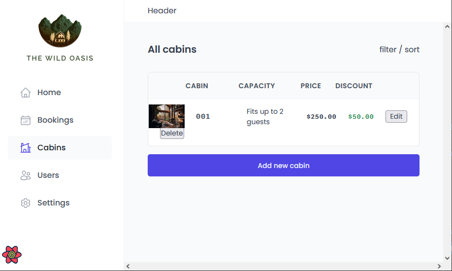

# React, supabase - hotel management app

# 🔗 [Live Preview](/live link of project deployed on Netlify etc/)

---

## About Project 👋

This was supposed to be a huge project that will be about managing hotel data for hotel staff. However, because of its complexity and the fact that it was also supposed to have a database and backend, which i cannot code at the moment, **the project has been abandoned.** 

---

## Technologies & Dependencies used 📦

- **Tanstack/react query, react hook form, hot toast, icons, router dom, styled components, supabese database, and eslint plugins** 

dependencies:

- "@tanstack/react-query": "^4.36.1",
- "@tanstack/react-query-devtools": "^4.36.1",
- "date-fns": "^4.1.0",
- "react": "^18.2.0",
- "react-dom": "^18.2.0",
- "react-hook-form": "^7.53.1",
- "react-hot-toast": "^2.4.1",
- "react-icons": "^5.3.0",
- "react-router-dom": "^6.27.0",
- "styled-components": "^6.1.13"

devDependencies:

- "@babel/plugin-proposal-private-property-in-object": "^7.21.11",
- "@babel/plugin-transform-private-property-in-object": "^7.25.9",
- "@supabase/supabase-js": "^2.46.1",
- "@types/react": "^18.2.15",
- "@types/react-dom": "^18.2.7",
- "@vitejs/plugin-react": "^4.0.3",
- "eslint": "^8.57.1",
- "eslint-config-react-app": "^7.0.1",
- "eslint-plugin-react": "^7.32.2",
- "eslint-plugin-react-hooks": "^4.6.0",
- "eslint-plugin-react-refresh": "^0.4.3",
- "vite": "^4.4.5",
- "vite-plugin-eslint": "^1.8.1"

---

## Prerequisites 📚

Ensure you have the following installed on your system:

    Node.js v18.00.0
    npm or yarn

---

## Clone & Run locally 🏃‍♂️

1. **Clone the Repository:**

   - On the GitHub repo page, click the green "Code" button.

   - Copy the HTTPS URL.

2. **Open the Terminal:**

   - Open the terminal by typing "cmd" in your desktop's start menu, **OR**

   - Right-click on the desktop and select "Git Bash Here" (if you have Git Bash installed), **OR**

   - Open Visual Studio Code's terminal by clicking "Terminal" -> "New Terminal" inside the editor.

3. **Navigate to Your Project Location:**

   - In the terminal, navigate to your desired location (e.g., desktop) using the command: `cd desktop`. Adjust the path if your project is located elsewhere.

   - Ensure that your terminal's address is inside the project folder.

4. **Clone the Repository:**

   - Run the command: `git clone /link/`. Replace `/link/` with the HTTPS URL from step 1.

5. **Enter the Project Directory:**

   - Navigate into the cloned repository by typing: `cd /folder-name/`. Replace `/folder-name/` with the name of the cloned folder.

6. **Install Dependencies:**

   - Run the command: `npm install` to install all the necessary dependencies.

7. **Start the Project:**

   - Run the command: `npm run dev` or `yarn dev` to start the project, if the project is created using Vite. You will need to manually open the browser address at [localhost:5173/](http://localhost:5173/)

---

## Project Structure 📂

    project-name/
    ├── public
    ├── src
    │ ├── assets
    │ ├── data
    │ │ ├── cabins
    | │ │ ├── (images)
    │ │ ├── (data files)
    │ ├── features (each subfolder contains many components)
    │ │ ├── authentication
    │ │ ├── bookings
    │ │ ├── cabins
    │ │ ├── check-in-out
    │ │ ├── dashboard
    │ │ ├── settings
    │ ├── hooks
    │ │ ├── (couple of reusable hooks)
    │ ├── pages
    │ │ ├── (all the pages the app contains)
    │ ├── services
    │ │ ├── (api calls and supabase)
    │ ├── styles
    │ │ ├── GlobalStyles.js
    │ ├── ui     
    │ │ ├── (lot of small UI components)     
    │ ├── utils
    │ │ ├── helper.js (helper functions)   
    │ ├── main.jsx
    │ └── App.jsx
    ├── (package.json, readme etc...)

---

## Contributing 💻

Contributions are closed.

---
